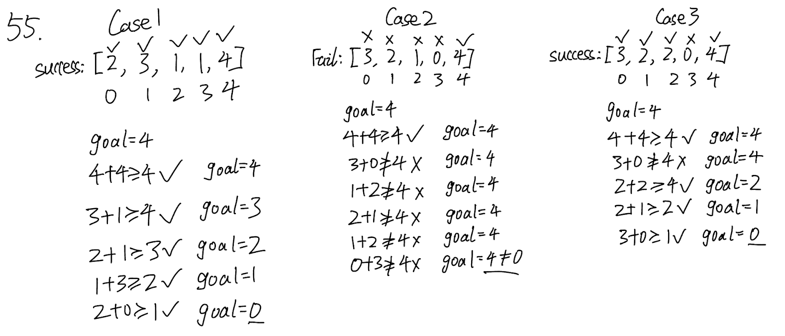

## 55. Jump Game (Medium)
**Date and Time:** Jun 26, 2024, 15:15 (EST)

Link: https://leetcode.com/problems/jump-game/

<br>

### Question:
You are given an integer array `nums`. You are initially positioned at the array's **first index**, and each element in the array represents your maximum jump length at that position.

Return `true` _if you can reach the last index, or_ `false` _otherwise_.

<br>

**Example 1:**
> **Input:** nums = [2, 3, 1, 1, 4] <br>
> **Output:** true <br>
> **Explanation:** Jump 1 step from index 0 to 1, then 3 steps to the last index.

**Example 2:**
> **Input:** nums = [3, 2, 1, 0, 4] <br>
> **Output:** false <br>
> **Explanation:** You will always arrive at index 3 no matter what. Its maximum jump length is 0, which makes it impossible to reach the last index.

<br>

### KeyPoints:
We start from the last index to the first index of `nums`, we compare `goal` with `i + nums[i]`, the current index of the element in `nums` plus `nums[i]`, if it is greater than `goal` that means we can reach to the current index. And we iteratively update `goal` by the current index number. You can think of `goal` as distance from the current index to the previous stopped index.

In the end, if `goal == 0` that means we have a way to reach the last index, look at case 2 below, even though the second to the last element can't reach to the last index, but the third to the last element can reach the last element, so we only want to know if `goal` is `0` in the end. 



<br>

### Greedy Solution:
```python
class Solution:
    def canJump(self, nums: List[int]) -> bool:
        # Set goal to be the last element
        goal = nums[-1]
        for i in range(len(nums)-1, -1, -1):
            if i + nums[i] >= goal:
                goal = i
        return True if goal == 0 else False
```
**Time Complexity:** $O(n)$ <br>
**Space Complexity:** $O(1)$

<br>

### DP Solution:
This is a very slow approach, we should use greedy method instead of this one.

But in the dP method, we need to make sure if a element from nums is in dP, then we can process it.

```python
class Solution:
    def canJump(self, nums: List[int]) -> bool:
        n=len(nums)
        dp = [False] * n
        dp[0] = True
        # Iterate the nums
        for i in range(n):
            if dp[i]:   # if this position is reachable
                # Iterate the steps of i can reach
                for j in range(0, nums[i]+1):
                    # Base case when we know we have a way to reach the end
                    if i + j == n-1:
                        return True
                    dp[i+j]=True
        return dp[n-1]
```
Time Complexity: $O(nk)$, where `k` is for number of jumps we take. <br>
Space Complexity: $O(n)$

<br>

