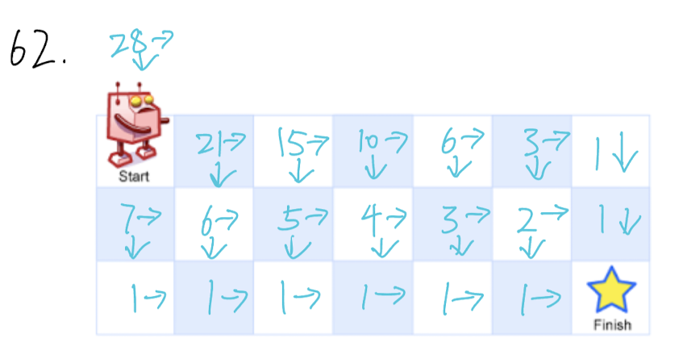

## 62. Unique Paths (Medium)
**Date and Time:** Jun 26, 2024, 16:45 (EST)

Link: https://leetcode.com/problems/unique-paths/

<br>

### Question:
There is a robot on an `m x n` grid. The robot is initially located at the **top-left corner** (i.e., `grid[0][0]`). The robot tries to move to the **bottom-right corner** (i.e., `grid[m - 1][n - 1]`). The robot can only move either down or right at any point in time.

Given the two integers `m` and `n`, return _the number of possible unique paths that the robot can take to reach the bottom-right corner_.

The test cases are generated so that the answer will be less than or equal to $2 * 10^9$.

<br>

**Example 1:**


> **Input:** m = 3, n = 7
> 
> **Output:** 28

**Example 2:**
> **Input:** m = 3, n = 2
> 
> **Output:** 3
>
> **Explanation:** From the top-left corner, there are a total of 3 ways to reach the bottom-right corner:
> 1. Right -> Down -> Down
> 2. Down -> Down -> Right
> 3. Down -> Right -> Down

<br>

### KeyPoints: 
We use DP to store how many ways for each grid to reach the **bottom-right corner**. For the bottom row and the right most column, they only have one way to reach the goal, so it is one for them. 



<br>

### Python DP Optimized Solution:
```python
class Solution:
    def uniquePaths(self, m: int, n: int) -> int:
        prev = [1] * n
        for r in range(m-2, -1, -1):
            dp = [1] * n
            for c in range(n-2, -1, -1):
                dp[c] = prev[c] + dp[c+1]
            prev = dp
        return prev[0]
```
**Time Complexity:** $O(m * n)$ <br>
**Space Complexity:** $O(n)$, we only store the previous row.

<br>

### Python DP Solution:
Same idea, but we just build the dp table first
```python
class Solution:
    def uniquePaths(self, m: int, n: int) -> int:
        dp = [[1] * n for _ in range(m)]
        for r in range(m-2, -1, -1):
            for c in range(n-2, -1, -1):
                dp[r][c] = dp[r+1][c] + dp[r][c+1]
        return dp[0][0]
```
**Time Complexity:** $O(m * n)$ <br>
**Space Complexity:** $O(m * n)$, because we store the whole `m * n` dp table.

<br>

