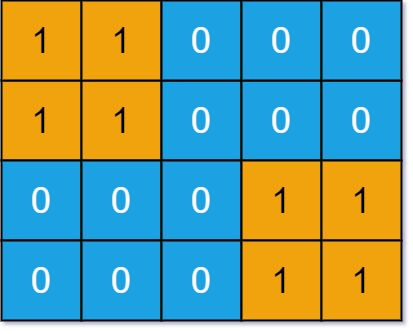
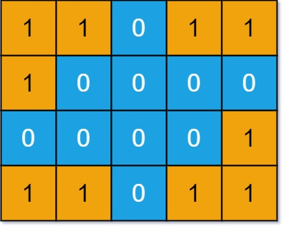

## 694. Number of Distinct Islands (Medium)
**Date and Time:** Jun 21, 2026

Link: https://leetcode.com/problems/number-of-distinct-islands/

<br>

### Question:
You are given an `m x n` binary matrix `grid`. An island is a group of `1`'s connected **4-directionally** (horizontal or vertical). You may assume all four edges of the grid are surrounded by water.

An island is considered to be the **same** as another if and only if one island can be translated (not rotated or reflected) to equal the other.

Return the number of **distinct** islands.

<br>

**Example 1:**



> **Input:** grid = [[1,1,0,0,0],[1,1,0,0,0],[0,0,0,1,1],[0,0,0,1,1]]
> 
> **Output:** 1

**Example 2:**



> **Input:** grid = [[1,1,0,1,1],[1,0,0,0,0],[0,0,0,0,1],[1,1,0,1,1]]
> 
> **Output:** 3

<br>

#### Constraints:
* `m == grid.length`

* `n == grid[i].length`

* `1 <= m, n <= 50`

* `grid[i][j]` is either `0` or `1`.

<br>

### Walk-through:
Two islands are identical (under translation) if and only if their cells have the same **relative positions** when anchored to the island's starting cell.

1. Scan the grid; for each unvisited `1`, run BFS and record each visited cell as `(orgR - r, orgC - c)` relative to the BFS start cell `(orgR, orgC)`.
2. Encode the list of relative positions as a string key. Because we scan top-to-bottom, left-to-right and use a fixed `directions` order, BFS produces the same traversal order for identically shaped islands.
3. Add the key to `keySet`. If it is new, increment `res`.

<br>

### Solution
```python
class Solution:
    def numDistinctIslands(self, grid: List[List[int]]) -> int:
        # Q: Find # of islands from grid
        # S: 1. Run BFS on each entry and mark all entries as visited in set()
        # 2. Set (row1: # col, row2: # col, row3: # col), tuple of num of cols in each row as key
        # Eg.2, (2, 1), (1, 2)
        # TC: O(mxn), SC: O(mxn)

        res = 0
        directions = [[-1, 0], [1, 0], [0, 1], [0, -1]]
        visited, keySet = set(), set()
        # Explore island and return tuple key for # of cols in each row for this island
        def bfs(r, c):
            deque = collections.deque()
            deque.append([r, c])
            visited.add((r, c))
            keyList = []
            orgR, orgC = r, c
            while deque:
                r, c = deque.popleft()
                # Record relative pos to compare islands
                keyList.append([orgR - r, orgC - c])
                # Explore neighbors
                for dr, dc in directions:
                    newR, newC = r+dr, c+dc
                    if newR in range(len(grid)) and newC in range(len(grid[0])) and (newR, newC) not in visited and grid[newR][newC] == 1:
                        deque.append([newR, newC])
                        visited.add((newR, newC))
            # Process tuple and return
            tupleKey = ""
            for r, c in keyList:
                tupleKey += "(" + str(r) + ", " + str(c) + ")"
            return tupleKey

        for r in range(len(grid)):
            for c in range(len(grid[0])):
                if (r, c) not in visited and grid[r][c] == 1:
                    key = bfs(r, c)
                    if key not in keySet:
                        keySet.add(key)
                        res += 1
        return res
```
**Time Complexity:** $O(m \times n)$ <br>
**Space Complexity:** $O(m \times n)$

<br>


