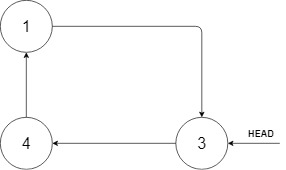

## 708. Insert into a Sorted Circular Linked List (Medium)
**Date and Time:** Dec 21, 2024, 22:21 (EST)

Link: https://leetcode.com/problems/insert-into-a-sorted-circular-linked-list

<br>

### Question:
Given a Circular Linked List node, which is sorted in non-descending order, write a function to insert a value `insertVal` into the list such that it remains a sorted circular list. The given node can be a reference to any single node in the list and may not necessarily be the smallest value in the circular list.

If there are multiple suitable places for insertion, you may choose any place to insert the new value. After the insertion, the circular list should remain sorted.

If the list is empty (i.e., the given node is `null`), you should create a new single circular list and return the reference to that single node. Otherwise, you should return the originally given node.

<br>

**Example 1:**



> **Input:** head = [3,4,1], insertVal = 2
> 
> **Output:** [3,4,1,2]
>
> **Explanation:** In the figure above, there is a sorted circular list of three elements. You are given a reference to the node with value 3, and we need to insert 2 into the list. The new node should be inserted between node 1 and node 3. After the insertion, the list should look like this, and we should still return node 3. <br>
> 

**Example 2:**
> **Input:** head = [], insertVal = 1
> 
> **Output:** [1]
>
> **Explanation:** The list is empty (given head is `null`). We create a new single circular list and return the reference to that single node.

**Example 3:**
> **Input:** head = [1], insertVal = 0
> 
> **Output:** [1,0]

**Edge Case:**
> **Input:** head = [3,3,3], insertVal = 3
> 
> **Output:** [3,3,3,3]

**Edge Case:**
> **Input:** head = [1,2,3], insertVal = 5
> 
> **Output:** [1,2,3,5]

**Edge Case:**
> **Input:** head = [1,2,3], insertVal = 0
> 
> **Output:** [0,1,2,3]

<br>

#### Constraints:
* The number of nodes in the list is in the range `[0, 5 * 10^4]`.

* `-10^6 <= Node.val, insertVal <= 10^6`

<br>

### Walk-through: 
Use `prev`, `curr` to compare with `insertVal`, so we know where is the right place to add `insertVal`.

There are three cases:

1. `prev.val <= insertVal <= curr.val`: If `insertVal` is between `prev.val` and `curr.val`, we can add `insertVal` after `prev`.

2. Add `insert` after tail, we check if `insertVal` is less than `head` or greater than tail. If one of the case is true, we add `insertVal` after the tail `prev`.

3. For all other cases (if all nodes are the same), we detect if run through a loop already `prev == head`. Then, we directly add `insertVal` after `prev`.

Finally, return the given node (`head`).

<br>

### Python Solution:
```python
"""
# Definition for a Node.
class Node:
    def __init__(self, val=None, next=None):
        self.val = val
        self.next = next
"""

class Solution:
    def insert(self, head: 'Optional[Node]', insertVal: int) -> 'Node':
        # Use prev, curr to keep track

        # Base case, if not head, create new node for insertVal
        # 1. insertVal is between prev and curr: prev.val <= insertVal <= curr.val
        # 2. insertVal should be added in the end of tail
        # 3. All nodes are the same, add insertVal after we loop over one circle

        # TC: O(n), n is total nodes, SC: O(1)
        # Create a circular linked list when head is null
        if not head:
            node = Node(insertVal)
            node.next = node
            return node
        
        prev, curr = head, head.next
        while True:
            # First case, if insertVal is between prev and curr
            if prev.val <= insertVal <= curr.val:
                break
            # Second case, when we reach the tail
            elif prev.val > curr.val:
                if insertVal > prev.val or insertVal < curr.val:
                    break
            prev, curr = curr, curr.next
            # Other cases, add the node after tail
            if prev == head:
                break
        # Create new node after head
        prev.next = Node(insertVal, curr)
        return head
```
**Time Complexity:** $O(n)$ <br>
**Space Complexity:** $O(1)$

<br>

