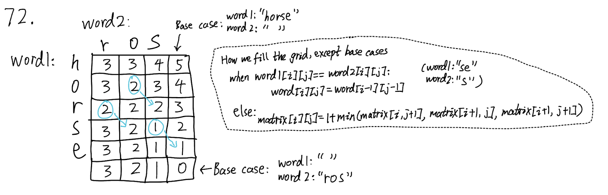
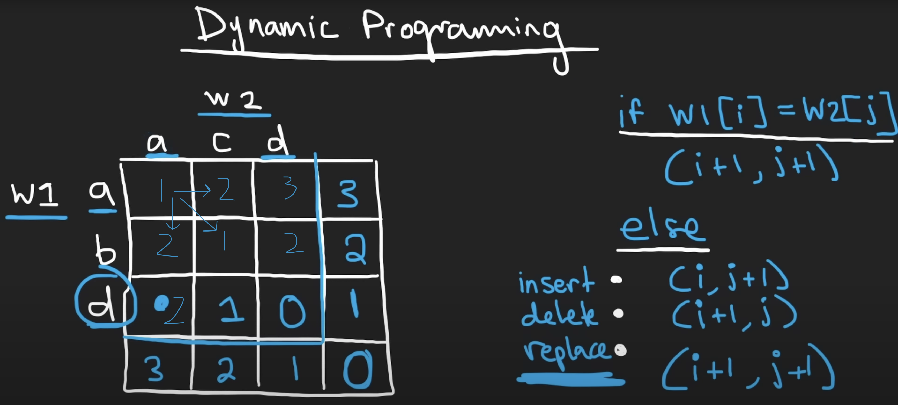

## 72. Edit Distance (Medium)
**Date and Time:** Jun 27, 2024, 0:56 (EST)

Link: https://leetcode.com/problems/edit-distance/

<br>

### Question:
Given two strings `word1` and `word2`, _return the minimum number of operations required to convert `word1` to `word2_`.

You have the following three operations permitted on a word:

- **Insert** a character
- **Delete** a character
- **Replace** a character

<br>

**Example 1:**
> **Input:** word1 = "horse", word2 = "ros" <br>
> **Output:** 3 <br>
> **Explanation:** <br>
> horse -> rorse (replace 'h' with 'r') <br>
> rorse -> rose (remove 'r') <br>
> rose -> ros (remove 'e') <br>

**Example 2:**
> **Input:** word1 = "intention", word2 = "execution" <br>
> **Output:** 5 <br>
> **Explanation:** <br>
> intention -> inention (remove 't') <br>
> inention -> enention (replace 'i' with 'e') <br>
> enention -> exention (replace 'n' with 'x') <br>
> exention -> exection (replace 'n' with 'c') <br>
> exection -> execution (insert 'u')

<br>

### Walk-through:
**DP bottom-up:**

In this case, I first create a dP table with an **extra row** and **extra column** for base cases. Then I fill out the base cases (bottom row and right-most column), and I fill out the grids by two conditions from the right-bottom corner to the left then go up. In each grid, we set the `dP[i][j]` to be either `dP[i][j] = dP[i+1][j+1]` (the diagonal entry) if `word1[i] == word2[j]`or `dP[i][j] = 1 + min(dP[i][j+1], dP[i+1][j], dP[i+1][j+1])` to find the minimum action of **Insert (i+1, j), Delete(i, j+1), or Replace(i+1, j+1)** with an extra 1.

**Note:** The first case to update entry does not require 1 operation, because when they match, we can just update both indices to the next indices (when they both match, we should use the previous result, because the # of differences doesn't change). But if we require Insert, Delete, or Replace we perform `1` operation.





<br>

**Optimized 1d DP:**
1. We first initialize the `prev` for the bottom of the dp table, which should be the distance for `word2`, so we use a for loop to initialize it.

2.  We then initialize `dp` row for each row with value `len(word1) - r`, which initialize the whole row to be the distance for current `word1` backward.

3. We update `dp` according to if these two words match or not, and we update `prev = dp` after loop over the whole columns.

<br>

### Python DP Solution:
```python
class Solution:
    def minDistance(self, word1: str, word2: str) -> int:
        # Create dP table
        dP = [[0] * (len(word2) + 1) for _ in range(len(word1)+1)]
        # Fill out base cases (botton row and right-most column)
        for j in range(len(dP[0])):
            dP[len(dP)-1][j] = len(word2) - j
        for i in range(len(dP)):    
            dP[i][len(dP[0])-1] = len(word1) - i

        # Fill out grids in reverse (bottom-up) order
        for i in range(len(word1)-1, -1, -1):
            for j in range(len(word2)-1, -1, -1):
                if word1[i] == word2[j]:
                    dP[i][j] = dP[i+1][j+1]
                else:
                    dP[i][j] = 1 + min(dP[i][j+1], dP[i+1][j], dP[i+1][j+1])
        return dP[0][0]
```
**Time Complexity:** $O(m * n)$, `m` is the length of `word1`, `n` is the length of `word2`. <br>
**Space Complexity:** $O(m * n)$, because we are storing the 2d DP table.

<br>

### Optimized DP Solution:
```python
class Solution:
    def minDistance(self, word1: str, word2: str) -> int:
        rows, cols = len(word1), len(word2)
        prev = [0] * (cols + 1)
        for c in range(cols-1, -1, -1):
            prev[c] = len(word2)-c

        for r in range(rows-1, -1, -1):
            dp = [(len(word1)-r)] * (len(word2)+1)
            for c in range(cols-1, -1, -1):
                if word1[r] == word2[c]:
                    dp[c] = prev[c+1]
                else:
                    dp[c] = 1 + min(dp[c+1], prev[c+1], prev[c])
            prev = dp
        return prev[0]
```
**Time Complexity:** $O(m * n)$, `m` is the length of `word1`, `n` is the length of `word2`. <br>
**Space Complexity:** $O(n)$, because we only store one row.

<br>

