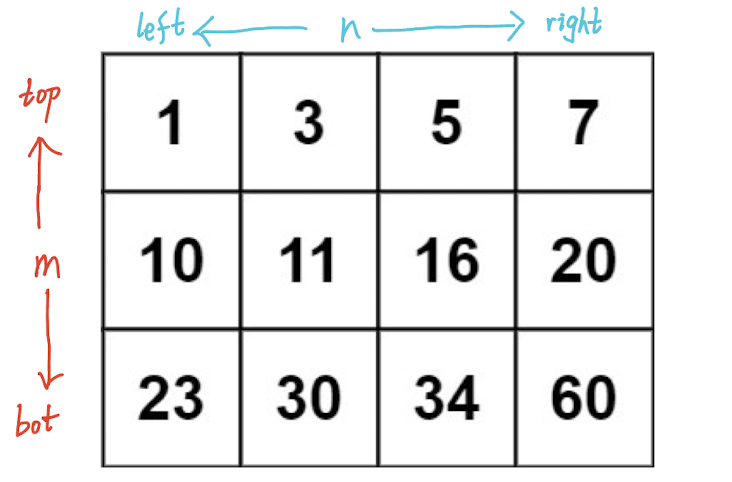
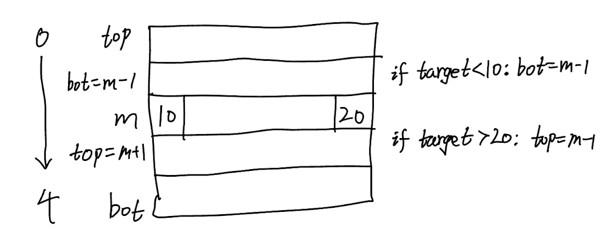

## 74. Search a 2D Matrix (Medium)
**Date and Time:** Jun 25, 2024, 22:04 (EST)

Link: https://leetcode.com/problems/search-a-2d-matrix/

<br>

### Question:
You are given an `m x n` integer matrix `matrix` with the following two properties:

- Each row is sorted in non-decreasing order.
- The first integer of each row is greater than the last integer of the previous row.

Given an integer `target`, return `true` _if_ `target` _is in_ `matrix` _or_ `false` _otherwise._

You must write a solution in `O(log(m * n))` time complexity.

<br>

**Example 1:**


> **Input:** matrix = [ [1, 3, 5, 7], [10, 11, 16, 20], [23, 30, 34, 60] ], target = 3
> 
> **Output:** true

**Example 2:**


> **Input:** matrix = [ [1, 3, 5, 7], [10, 11, 16, 20], [23, 30, 34, 60] ], target = 13
> 
> **Output:** false

<br>

### KeyPoints:
To achieve $O(log(m*n))$, we need to use **binary search** on `rows` to find the row where target will be, then use **binary search** again to find the col of target. Same as normal binary search, we find the mid row or mid col, then iteratively update the left/right or top/bot indices.





__Be careful__ about the way to update the index of top and bot, if `target < matrix[m][0]`, `bot = m - 1` (go up one row), if `target > matrix[m][-1] (last element of row m)`, `top = m + 1` (go down one row).

<br>

### My Solution:
```python
class Solution:
    def searchMatrix(self, matrix: List[List[int]], target: int) -> bool:
        # Run binary search for rows then cols
        rows, cols = len(matrix), len(matrix[0])
        top, bot = 0, rows - 1
        while top <= bot:
            m = (top + bot) // 2
            if target < matrix[m][0]:
                bot = m - 1
            # elif target > matrix[m] last element
            elif target > matrix[m][-1]:
                top = m + 1
            else:
                break
        # If top > bot, there does not exist row can have target
        if not (top <= bot):
            return False
        
        # Now run binary search for cols
        left, right = 0, cols - 1
        while left <= right:
            n = (left + right) // 2
            if target < matrix[m][n]:
                right = n - 1
            elif target > matrix[m][n]:
                left = n + 1
            else:
                return True
        return False
```
Time Complexity: $O(log(m*n))$, because we use binary search for rows take $O(log\ m)$, then use binary search for cols take $O(log\ n)$.

<br>

