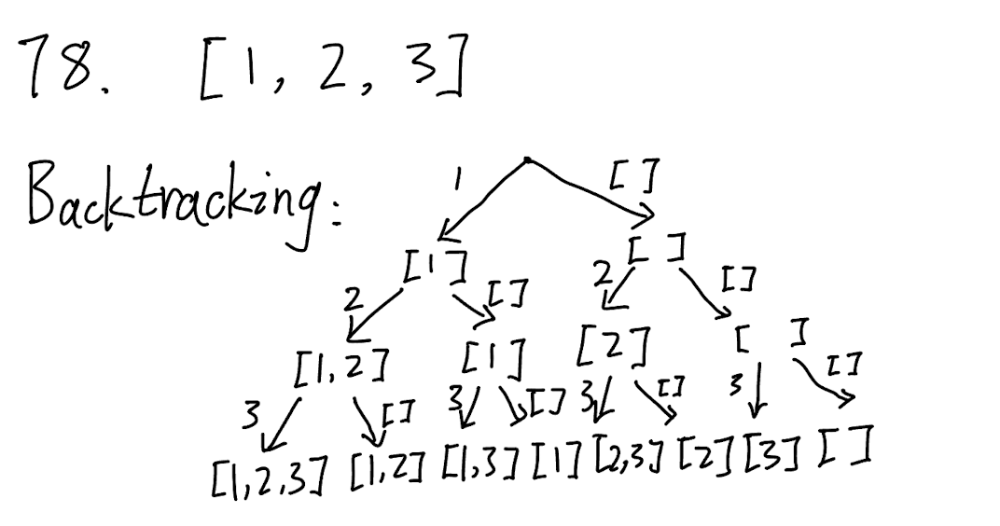

## 78. Subsets (Medium)
**Date and Time:** Jun 21, 2024, 1:53 PM (EST)

Link: https://leetcode.com/problems/subsets/

<br>

### Question:
Given an integer array `nums` of **unique** elements, _return all possible 
subsets (the power set)_.

The solution set __must not__ contain duplicate subsets. Return the solution in __any order__.

<br>

**Example 1:**
> **Input:** nums = [1,2,3]
> 
> **Output:** [ [], [1], [2], [1,2], [3], [1,3], [2,3], [1,2,3] ]

**Example 2:**
> **Input:** nums = [0]
> 
> **Output:** [ [], [0] ]

<br>

### KeyPoints: 
This is the illustration of backtracking for this problem. To form all possible subsets, we can use empty set `[]` to create a subset that can skip an element, like "`[1, 3]`". 



<br>

### My Solution:
```python
class Solution:
    def subsets(self, nums: List[int]) -> List[List[int]]:
        res = []
        subset = []
        def dfs(i):
            # Base case when we reach the leaf
            if i >= len(nums):
                res.append(subset.copy())
                return
            subset.append(nums[i])
            dfs(i+1)
            # Start backtracking, remove the last index, e.g, [1,2,3]->[1,2], [1,3]->[1], [2,3]->[2]
            subset.pop()
            dfs(i+1)
        dfs(0)
        return res
```

<br>

