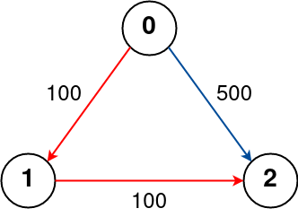

## 787. Cheapest Flights Within K Stops (Medium)
**Date and Time:** Sep 26, 2024, 13:20 (EST)

Link: https://leetcode.com/problems/cheapest-flights-within-k-stops/

<br>

### Question:
There are `n` cities connected by some number of flights. You are given an array `flights` where `flights[i] = [from_i, to_i, price_i]` indicates that there is a flight from city `from_i` to city `to_i` with cost `price_i`.

You are also given three integers `src`, `dst`, and `k`, return **the cheapest price** from `src` to `dst` with at most `k` stops. If there is no such route, return `-1`.

<br>

**Example 1:**


> **Input:** n = 4, flights = [[0,1,100],[1,2,100],[2,0,100],[1,3,600],[2,3,200]], src = 0, dst = 3, k = 1
> 
> **Output:** 700
>
> **Explanation:** <br>
> The graph is shown above. <br>
> The optimal path with at most 1 stop from city 0 to 3 is marked in red and has cost 100 + 600 = 700. <br>
> Note that the path through cities [0,1,2,3] is cheaper but is invalid because it uses 2 stops.

**Example 2:**



> **Input:** n = 3, flights = [[0,1,100],[1,2,100],[0,2,500]], src = 0, dst = 2, k = 1
> 
> **Output:** 200
>
> **Explanation:** <br>
> The graph is shown above. <br>
> The optimal path with at most 1 stop from city 0 to 2 is marked in red and has cost 100 + 100 = 200.

**Example 3:**


> **Input:** n = 3, flights = [[0,1,100],[1,2,100],[0,2,500]], src = 0, dst = 2, k = 0
> 
> **Output:** 500
>
> **Explanation:** <br>
> The graph is shown above. <br>
> The optimal path with no stops from city 0 to 2 is marked in red and has cost 500.

<br>

#### Constraints:
* `1 <= n <= 100`

* `0 <= flights.length <= (n * (n - 1) / 2)`

* `flights[i].length == 3`

* `0 <= from_i, to_i < n`

* `from_i != to_i`

* `1 <= price_i <= 10^4`

* There will not be any multiple flights between two cities.

* `0 <= src, dst, k < n`

* `src != dst`

<br>

### Walk-through: 
1. Initialize `prices[]` with `float("inf)`, so later we can get price from the list.

2. We loop over `k+1` times, and for each time we check `flights` and make update `tmp = prices.copy()` with `tmp[d] = prices[s] + p` if `prices[s] + p < tmp[d]`. By checking `prices` not `tmp`, we can make sure that we only make update for one level of nodes within `k` stops. (Because we first initalize prices[src] = 0, so in the algorithm we will only able to update `src`'s neighbors, and in next level, we can update `src`'s neighbors' neighbors).

3. Finally, we return `-1` if `prices[dst] == float("inf)` so we know `prices[dst]` is not able to reach, otherwise, we just return `prices[dst]`.

<br>

### Python Solution:
```python
class Solution:
    def findCheapestPrice(self, n: int, flights: List[List[int]], src: int, dst: int, k: int) -> int:
        prices = [float("inf")] * n
        prices[src] = 0
        
        for _ in range(k+1):
            tmp = prices.copy()
            for s, d, p in flights:
                if prices[s] + p < tmp[d]:
                    tmp[d] = prices[s] + p
            prices = tmp
        return -1 if prices[dst] == float("inf") else prices[dst]
```
**Time Complexity:** $O(E * k)$, `E` is the total edges in the graph, because every time we have to check all `flights` (all edges), and we need to check `k` times. <br>
**Space Complexity:** $O(n)$, `n` is total nodes we have.

<br>

