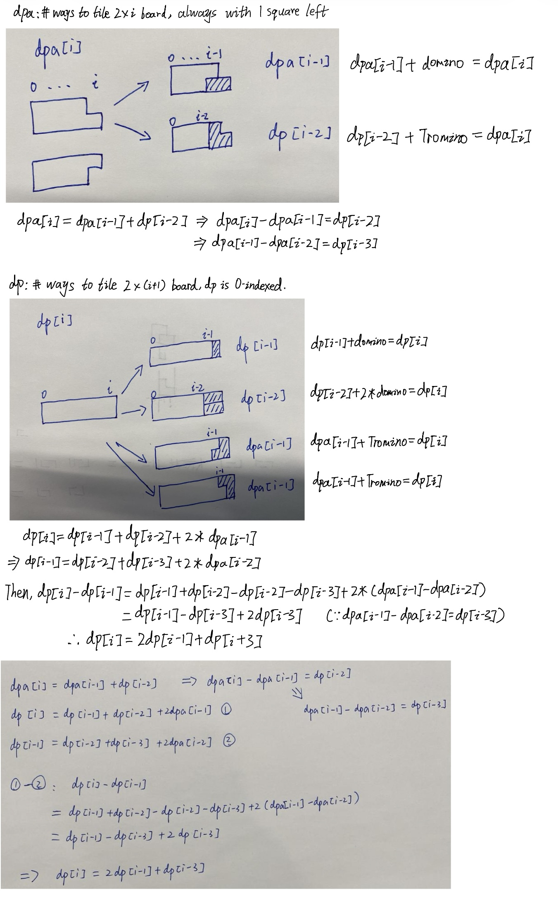

## 790. Domino and Tromino Tiling (Medium)
**Date and Time:** Aug 23, 2024, 16:02 (EST)

Link: https://leetcode.com/problems/domino-and-tromino-tiling/

<br>

### Question:
You have two types of tiles: a `2 x 1` domino shape and a tromino shape. You may rotate these shapes.


Given an integer n, return _the number of ways to tile an_ `2 x n` _board_. Since the answer may be very large, return it **modulo** `10^9 + 7`.

In a tiling, every square must be covered by a tile. Two tilings are different if and only if there are two 4-directionally adjacent cells on the board such that exactly one of the tilings has both squares occupied by a tile.

<br>

**Example 1:**


> **Input:** n = 3
> 
> **Output:** 5
>
> **Explanation:** The five different ways are show above.

**Example 2:**
> **Input:** 1
> 
> **Output:** 1

<br>

#### Constraints:
* `1 <= n <= 1000`

<br>

### Walk-through: 
For each `i`, we need to find how many ways we can combine the `2 x i` domino shape with domino tile and Tromino tile. We know the base case for the domino are `i = 0, dp[0] = 0`; `i = 1, dp[1] = 1`; `i = 2, dp[2] = 2`; `i = 3, dp[3] = 5`. And we append the res of `dp = 0`.

1. We use `dpa[i]` to denote the # of ways to form a `2 x i` domino shape with an extra square left, look at the graph below for `dpa`, we notice there are two ways to form this shape, first by taking `dpa[i-1]` + 1 domino, second by taking `dp[i-2]` + 1 Tromino. So we add these two ways together for `dpa[i] = dpa[i-1] + dp[i-2]`.

2. We use `dp[i]` to denote the # of ways to form `2 x i` domino shape, look at the graph below for `dp`. We notice there are four ways to form, `dp[i-1]` + 1 vertical domino, `dp[i-2]` + 2 horizontal domino, `dpa[i-1]` + 1 Tromino, and another `dpa[i-1]` + 1 Tromino. So, `dp[i] = dp[i-1] + dp[i-2] + 2 * dpa[i-1]`. <br> **Notice** we don't need to count for `dp[i-3]` or etc, because the case of `dp[i-2]` already cover all the previous cases and the total number of ways for us to use `dp[i-3]`, so they are already included.

3. By rearraging these two recurrence relations, we can combine them into the final recurrence relation: `dp[i] = (2 * dp[i-1] + dp[i-3]) % (10**9 + 7)`.

<br>



<br>

### More intuitive:
We use `dp` and `dpa` to compose `dp[i]`.

We set the range in the for loop `[2, n-1]`, because the tromino takes `2 x 2` as the base case and there is only 1 way to place that (count the extra block up and down the same).

<br>

### Python Solution:
```python
class Solution:
    def numTilings(self, n: int) -> int:
        dp = [0, 1, 2, 5] + [0] * (n - 3)
        for i in range(4, n+1):
            dp[i] = (2 * dp[i-1] + dp[i-3]) % (10**9 + 7)
        return dp[n]
```
**Time Complexity:** $O(n)$ <br>
**Space Complexity:** $O(n)$

<br>

### More intuitive Solution:
```python
class Solution:
    def numTilings(self, n: int) -> int:
        # First create a dp table
        # Find the relationship between i-1, i-2, etc
        # Base case: dp[0] = 0, dp[1] = 1, dp[2] = 2, dp[3] = 5
        # Base case for dpa: dpa[0] = 0, dpa[1] = 1
        # For dp[i]: how many ways to compose dp[i]
        # dp[i] = dp[i-1] + dp[i-2] + dpa[i-1] * 2
        # dpa[i] = dpa[i-1] + dp[i-2]

        # TC: O(n), SC: O(n)
        dp = [1, 2] + [0] * n
        dpa = [1] * n
        # The smallest n we can start is 2
        for i in range(2, n):
            dpa[i] = (dpa[i-1] + dp[i-2]) % (10**9 + 7)
            dp[i] = (dp[i-1] + dp[i-2] + dpa[i-1] * 2) % (10**9 + 7)
        return dp[n-1]
```
**Time Complexity:** $O(n)$ <br>
**Space Complexity:** $O(n)$

<br>

