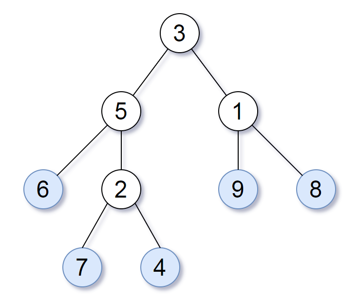
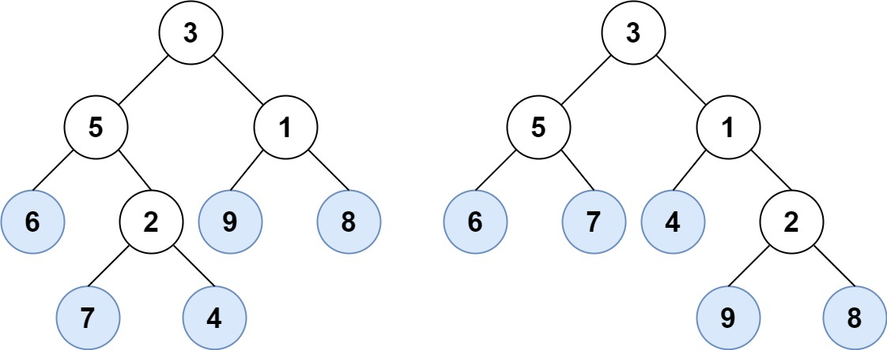
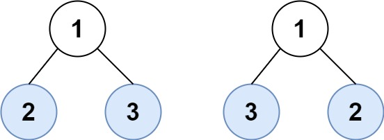

## 872. Leaf-Similar Trees (Easy)
**Date and Time:** Oct 13, 2024, 14:41 (EST)

Link: https://leetcode.com/problems/leaf-similar-trees/

<br>

### Question:
Consider all the leaves of a binary tree, from left to right order, the values of those leaves form a **leaf value sequence**.



For example, in the given tree above, the leaf value sequence is `(6, 7, 4, 9, 8)`.

Two binary trees are considered leaf-similar if their leaf value sequence is the same.

Return `true` if and only if the two given trees with head nodes `root1` and `root2` are leaf-similar.

<br>

**Example 1:**



> **Input:** root1 = [3,5,1,6,2,9,8,null,null,7,4], root2 = [3,5,1,6,7,4,2,null,null,null,null,null,null,9,8]
>
> **Output:** true

**Example 2:**



> **Input:** root1 = [1,2,3], root2 = [1,3,2]
>
> **Output:** false

<br>

#### Constraints:
* The number of nodes in each tree will be in the range `[1, 200]`.

* Both of the given trees will have values in the range `[0, 200]`.

<br>

### Walk-through:
Run DFS to reach the leaf node, and append `leafnode.val` into `res[]`, do the same thing for `root1, root2`. Finally, compare `res == res2`, so we know they have the same leaf node or not.

<br>

### Python Solution:
May 17, 2026, time taken 12m 55s.
```python
# Definition for a binary tree node.
# class TreeNode:
#     def __init__(self, val=0, left=None, right=None):
#         self.val = val
#         self.left = left
#         self.right = right
class Solution:
    def leafSimilar(self, root1: Optional[TreeNode], root2: Optional[TreeNode]) -> bool:
        # Run dfs twice on root1 and root2.
        # TC: O(n), n is total nodes. SC: O(n)
        def dfs(node, lst):
            if not node.left and not node.right:
                lst.append(node.val)
                return lst
            if node.left:
                lst = dfs(node.left, lst)
            if node.right:
                lst = dfs(node.right, lst)
            return lst
        return dfs(root1, []) == dfs(root2, [])
```
**Time Complexity:** $O(n)$, `n` is the total nodes. <br>
**Space Complexity:** $O(n)$

<br>


