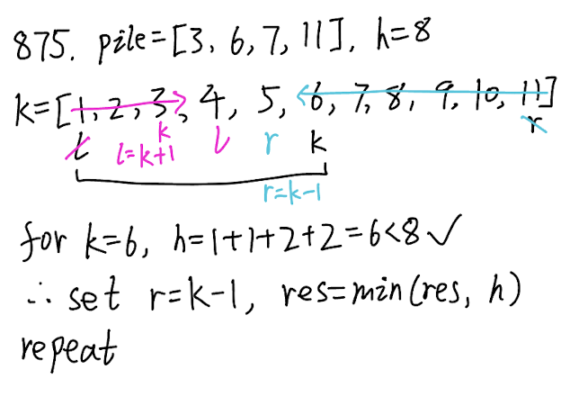

## 875. Koko Eating Bananas (Medium)
**Date and Time:** Jul 18, 2024, 22:47 (EST)

Link: https://leetcode.com/problems/koko-eating-bananas/

<br>

### Question:
Koko loves to eat bananas. There are `n` piles of bananas, the `ith` pile has `piles[i]` bananas. The guards have gone and will come back in `h` hours.

Koko can decide her bananas-per-hour eating speed of `k`. Each hour, she chooses some pile of bananas and eats `k` bananas from that pile. If the pile has less than `k` bananas, she eats all of them instead and will not eat any more bananas during this hour.

Koko likes to eat slowly but still wants to finish eating all the bananas before the guards return.

Return the minimum integer `k` such that she can eat all the bananas within `h` hours.

<br>

**Example 1:**
> **Input:** piles = [3,6,7,11], h = 8
> 
> **Output:** 4

**Example 2:**
> **Input:** piles = [30,11,23,4,20], h = 5
> 
> **Output:** 30

**Example 3:**
> **Input:** piles = [30,11,23,4,20], h = 6
> 
> **Output:** 23

<br>

#### Constraints:
* `1 <= piles.length <= 10^4`

* `piles.length <= h <= 10^9`

* `1 <= piles[i] <= 10^9`

<br>

### KeyPoints: 
We can find the range of `k` from `[1, max(piles)]`, if `k` can lead to `hours < h` (hours is sum of current `k`), we update `res = min(res, k)`. We then update `r = k - 1` if `hours <= h`, because we want to find the minimum `k`. If `hours > h`, we update `l = k + 1`, that means we don't want to find some range from `k`'s left.



<br>

### My Solution:
```python
class Solution:
    def minEatingSpeed(self, piles: List[int], h: int) -> int:
        # Use binary search on range of k
        # Shift left if we found the right k then find its smaller value
        res = float("inf")
        l, r = 1, max(piles)  # The range of k
        while l <= r:
            k = (l + r) // 2
            hours = 0
            for i in piles:
                hours += ceil(i / k)
            if hours <= h:
                res = min(res, k)
                r = k - 1
            else:
                l = k + 1
        return res
```
**Time Complexity:** $O(log\ n)$ <br>
**Space Complexity:** $O(1)$

<br>

