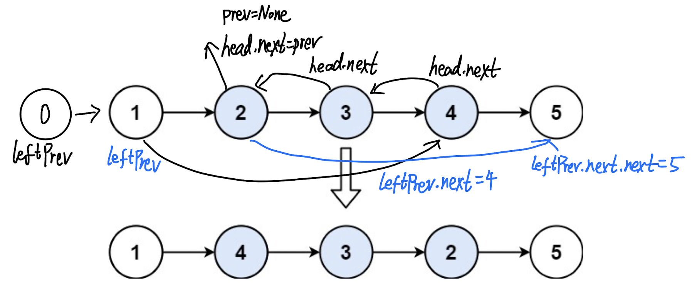

## 92. Reverse Linked List II (Medium)
**Date and Time:** Jul 30, 2024, 23:59 (EST)

Link: https://leetcode.com/problems/reverse-linked-list-ii/

<br>

### Question:
Given the `head` of a singly linked list and two integers `left` and `right` where `left <= right`, reverse the nodes of the list from position `left` to position `right`, and return _the reversed list_.

<br>

**Example 1:**


> **Input:** head = [1,2,3,4,5], left = 2, right = 4
> 
> **Output:** [1,4,3,2,5]

**Example 2:**
> **Input:** head = [5], left = 1, right = 1
> 
> **Output:** [5]

<br>

#### Constraints:
* The number of nodes in the list is `n`.

* `1 <= n <= 500`

* `-500 <= Node.val <= 500`

* `1 <= left <= right <= n`

<br>

### Walk-through: 
1. Save the node before `left` to be `leftPrev`, we initialize `leftPrev` with `dummy = ListNode(0, head)` so that we can use a for loop to reach the node before `left` in `range(left - 1)`.

2. We use the method in [206. Reverse Linked List](./questions/206.Reverse_Linked_List(Easy).md) to reverse the links of all the nodes between `left` and `right`.

3. Finally, we relink `leftPrev.next` to `right` node, and the previous `left` node next to be `head.next`.



<br>

### Python Solution:
```python
# Definition for singly-linked list.
# class ListNode:
#     def __init__(self, val=0, next=None):
#         self.val = val
#         self.next = next
class Solution:
    def reverseBetween(self, head: Optional[ListNode], left: int, right: int) -> Optional[ListNode]:
        dummy = ListNode(0, head)
        leftPrev = dummy
        # Move until left
        for _ in range(left - 1):
            leftPrev, head = head, head.next
        prev = None
        for _ in range(right - left + 1):
            tmp = head.next
            head.next = prev
            prev = head
            head = tmp
        # Relink all nodes together
        leftPrev.next.next = head
        leftPrev.next = prev
        return dummy.next
```
**Time Complexity:** $O(n)$ <br>
**Space Complexity:** $O(1)$

<br>

### Java Solution:
```java

```

<br>

### C++ Solution:
```cpp

```

<br>

### Runtime and Memory comparison
|Language|Runtime|Memory|
|---|---|---|
|Python3| ms| MB|
|Java   | ms| MB|
|C++    | ms| MB|

<br>

