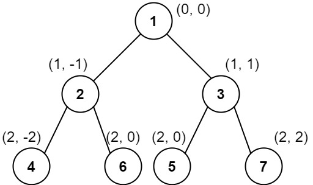

## 987. Vertical Order Traversal of a Binary Tree (Hard)
**Date and Time:** Dec 19, 2024, 10:39 (EST)

Link: https://leetcode.com/problems/vertical-order-traversal-of-a-binary-tree

<br>

### Question:
Given the `root` of a binary tree, calculate the **vertical order traversal** of the binary tree.

For each node at position `(row, col)`, its left and right children will be at positions `(row + 1, col - 1)` and `(row + 1, col + 1)` respectively. The root of the tree is at `(0, 0)`.

The **vertical order traversal** of a binary tree is a list of top-to-bottom orderings for each column index starting from the leftmost column and ending on the rightmost column. There may be multiple nodes in the same row and same column. In such a case, sort these nodes by their values.

Return the **vertical order traversal** of the binary tree.

<br>

**Example 1:**


> **Input:** root = [3,9,20,null,null,15,7]
> 
> **Output:** [[9],[3,15],[20],[7]]
>
> **Explanation:** <br>
> Column -1: Only node 9 is in this column. <br>
> Column 0: Nodes 3 and 15 are in this column in that order from top to bottom. <br>
> Column 1: Only node 20 is in this column. <br>
> Column 2: Only node 7 is in this column.

**Example 2:**


> **Input:** root = [1,2,3,4,5,6,7]
> 
> **Output:** [[4],[2],[1,5,6],[3],[7]]
>
> **Explanation:** <br>
> Column -2: Only node 4 is in this column. <br>
> Column -1: Only node 2 is in this column. <br>
> Column 0: Nodes 1, 5, and 6 are in this column. <br>
>           1 is at the top, so it comes first. <br>
>           5 and 6 are at the same position (2, 0), so we order them by their value, 5 before 6.  <br>
> Column 1: Only node 3 is in this column. <br>
> Column 2: Only node 7 is in this column. <br>

**Example 3:**



> **Input:** root = [1,2,3,4,6,5,7]
> 
> **Output:** [[4],[2],[1,5,6],[3],[7]]
>
> **Explanation:** <br>
> This case is the exact same as example 2, but with nodes 5 and 6 swapped. <br>
> Note that the solution remains the same since 5 and 6 are in the same location and should be ordered by their values.

<br>

#### Constraints:
* The number of nodes in the tree is in the range `[1, 1000]`.

* `0 <= Node.val <= 1000`

<br>

### Walk-through: 
1. Run BFS from root, and we save each node with their row, col `deque[(node, row, col)]`. If `node.left` we append `deque[(node.left, row+1, col-1)]`. If `node.right`, we append `deuqe[(node.right, row+1, col+1)]`.

2. Use hashmap to save every node with the same column `hashmap{col: [node.val]}`. 

3. After that, we need to sort `hashmap.keys()` to sort columns, and sort `hashmap[key]` to sort values by row.

<br>

### Python Solution:
```python
# Definition for a binary tree node.
# class TreeNode:
#     def __init__(self, val=0, left=None, right=None):
#         self.val = val
#         self.left = left
#         self.right = right
class Solution:
    def verticalTraversal(self, root: Optional[TreeNode]) -> List[List[int]]:
        # Add node with same col into hashmap
        # Save each node with row, col into deque[]
        # Run BFS to append node's children with row+1, and col+1 or col-1
        # Sort hashmap by col and row

        # TC: O(nlogn), n is total nodes, SC: O(n)
        hashmap = collections.defaultdict(list)     # {col: [(row, node.val)]}
        deque = collections.deque([(root, 0, 0)])   # [(node, row, col)]
        while deque:
            node, row, col = deque.popleft()
            hashmap[col].append((row, node.val))
            if node.left:
                deque.append((node.left, row+1, col-1))
            if node.right:
                deque.append((node.right, row+1, col+1))
        res = []
        # Sort col and row
        for key in sorted(hashmap.keys()):
            res.append([val for row, val in sorted(hashmap[key])])
        return res
```
**Time Complexity:** $O(nlog\ n)$, we sort `keys()`. <br>
**Space Complexity:** $O(n)$

<br>

